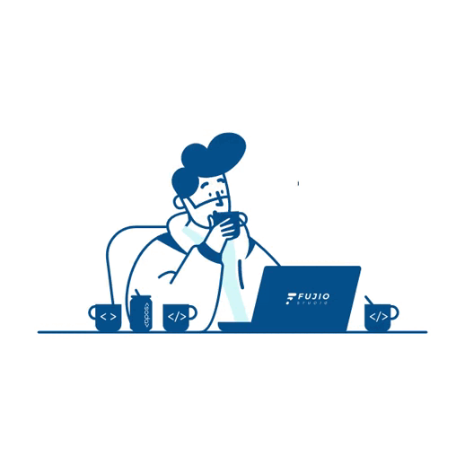

## Hey 👋, I'm [Boni Gope!](https://bonigope.com/)

### Visitor count

### Glad to see you here!
👨‍💻 I am a Software Engineer with over 6+ years of experience in Full Stack Development. My primary focus has been on JavaScript, Vue.js, Laravel, and MySQL technologies. I have a strong passion for continuous learning and thrive on tackling diverse challenges across various technologies and domains 💡. I find joy in exploring cutting-edge technologies and utilizing them to solve real-life problems ✨. Additionally, I derive immense satisfaction from guiding and mentoring aspiring developers 👨🏻‍💻. Currently, my main area of expertise lies in Full Stack Web Development 🕸️, and I am actively honing my skills in Data Structures and Algorithms 🤓 to further excel in my craft.

### Talking about Personal Stuffs:

- 🛠 &nbsp; I’m currently working with Nuxtjs,Nodejs, Express, Vuejs,  ,Mysql Mongodb, Javascript, etc.
- 🚀 &nbsp; Committed to delivering in both backend and full stack development.
- 👨🏻‍💻 &nbsp; You can find all of my impressive projects at [Github](https://github.com/boni619).
- 💬 &nbsp; Feel free to ask me anything about Laravel, Vue.js, or JavaScript; I'd be happy to share my knowledge with you!.
- 👾 &nbsp; Fun fact: Besides coding, I love to immerse myself in the thrilling world of DOTA 2! 🎮 Let's take some breaks, have fun, and learn together! Happy coding!
- 📫 &nbsp; Want to get in touch? Reach me at boni619@gmail.com, and let's connect!
- 📝 &nbsp; Checkout my [Resume](https://drive.google.com/file/d/1xe3pfKmqHvVcV5l-hQPhlcp12dSEhP4g/view).

## Tech Stack 💻
### 👉 Front-end

### 👉 Back-end

### 👉 Programming Language

### 👉 Database

### 👉 Unit Testing

### 👉 Version Control

### 👉 Others

 

## ⚙️ Stats
 
 

### 🔝 Top Contributed Repo

### Show some ❤️ by starring some of my repositories!

